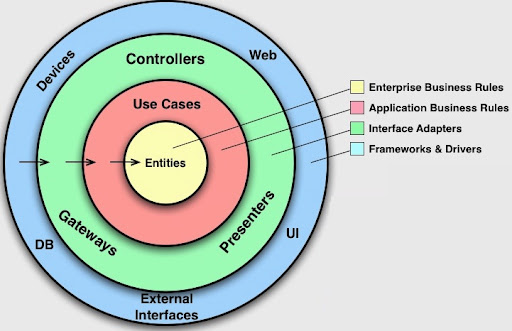
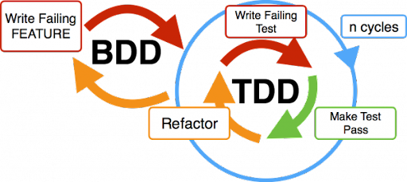
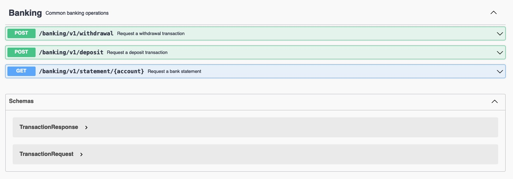

# Restful Banking API built using BDD and TDD

This application serves a banking API capable of processing deposits, withdrawals and statement printing.

## Architecture
The application is organised following **Clean Architecture** and **DDD**, with *use cases* a.k.a *application services* in the `application` package being responsible for co-ordinating *domain* objects in the `domain` package.
The outer layer, `adapter`, contains the `controller` and `persistence` packages.  
Only application services are allowed to reference domain objects as dependencies must always point inwards (**the dependency rule**).



## Development

I used BDD (outside-in) combined with TDD (red, green, refactor) to guide my development.  



I have implemented only one acceptance test that triggered everything else. All unit tests required to guide my development have been created. They all run without the Spring application context nor do they need to access any other component or infrastructure. After all, they are unit tests!  
The only exception are the *Controller* unit tests that partially load the Spring application context and use `MockMvc` to interact with the Controller without running the embedded server. 

## Acceptance tests

If we are practising Continuous Delivery, we must have all our tests automated. I practiced BDD and used Cucumber with JUnit 5. The scenario is an executable specification of the expected behaviour of the API.  
  
## Architectural decisions
1. Adopted **Clean Architecture** to allow the application to grow whilst keeping their maintainability. Different concerns are kept separate in different layers.
1. The `adapter` layer made up by the `controller` and `persistence` packages can be swapped out without affecting the inner layers: `services` and `domain`.
1. Used Spring Boot to quickly get done all the cross-cutting concerns and the plumbing required by an enterprise-grade application so I could focus on the application behaviour.
1. To exemplify the second point above, leveraging the Spring Boot capabilities, we can easily add support to different databases within the persistence layer, for example: (in-memory) H2 and MySQL/PostgreSQL.
1. Security has not been implemented for simplicity's sake  although it would be required in a real-life application. We can leverage Spring Security to do so.

## API documentation (OpenAPI)

I have used the `springdoc-openapi` project to automatically render a HTML page containing the OpenAPI v3 documentation for all endpoints exposed via *Spring Boot Controllers*.
I find automatically generated documentation the best option to keep the documentation always up to date whilst following one of the tenets of the [Agile Manifesto](https://agilemanifesto.org/): **Working software over comprehensive documentation**.  
  
With the application running, you can consult the API documentation by pointing your browser at `http://localhost:8080/swagger-ui.html`




## How to test and run the application

**You need to have Java 21 installed.**  

Type of test|Command line
:---:|---
unit|`./mvnw test`
acceptance|`./mvnw test -P acceptance`
integration|`./mvnw verify -P integration`

The acceptance tests report will be available at `target/AcceptanceTestReports/report.html`

The integration tests will try to download and spin up a MySQL container.  
**N.B.**: You need to have a Docker daemon running on your machine.

- To build the application, enter:
```  
./mvnw clean package
```
- To run the application using the embedded in-memory database, enter:
```
java -jar target/banking-demo-api-1.0.0.jar
```
  The API endpoint will be available at `localhost:8080`

- You can interact with the application through your favourite API testing client. I used [HTTPie](https://httpie.io/) in the examples below:
```
http post :8080/banking/v1/deposit Content-Type:application/json account=123456 amount=1000
http post :8080/banking/v1/withdrawal Content-Type:application/json account=123456 amount=900
http post :8080/banking/v1/deposit Content-Type:application/json account=123456 amount=100.55
http :8080/banking/v1/statement/123456
```
  If you have [jQuery](https://jquery.com/download/) installed on your machine, you can replace the last command above for 
```
http :8080/banking/v1/statement/123456 | jq -r .message
```

  You can inspect the in-memory database pointing your browser at `localhost:8080/h2`. Make sure the *JDBC URL* field contains `jdbc:h2:mem:database`. Click on the **Connect** button.


- We can build a container image of the application directly from Maven without using *Dockerfiles* by using [Cloud Native Buildpacks](https://buildpacks.io/). The `spring-boot-maven-plugin` plugin can create an OCI image from the application jar file.  
  <br>
  **N.B.**: You need to have a Docker daemon running on your machine. The build-image goal requires access to it. By default, it will communicate with the Docker daemon over a local connection.
  This works with Docker Engine on all supported platforms without configuration.  
  <br>
  To build a container image that can run in the cloud, enter:
```
  mvn spring-boot:build-image
```

  The [Paketo Spring Boot buildpack](https://github.com/paketo-buildpacks/spring-boot) is going to build an image with the `docker.io/library/banking-demo-api:1.0.0` tag by default.

- To build and run both the application and MySQL containers, enter:  
  `make docker-up`  
  
  The Makefile is going to use the Paketo buildpack mentioned above to build the application container. It will then spin two containers up: *app* and *database*. The application is going to connect to the MySQL database this time.  
  To verify the containers running, from the *project-root* folder enter:  
  `docker-compse ps`  
  
  The application will be available at `localhost:8080` again.  
  
  The MySQL database running in its container can be accessed through the *root* user with *password* password. For example, if you have MySQL client installed on your machine, use:  
  `mysql -u root -ppassword -h 127.0.0.1 database`  
  
- To shut down both containers, from the *project root* folder enter:  
  `make docker-down` 

## Vulnerabilities Scanning
The OWASP `dependency-check` plugin accesses the NIST National Vulnerability Database to update its list of known vulnerabilities.
It uses the API Key that is stored in the pipeline. When tyring to build the app on your laptop without the key, the following warning message is going to be printed:
>[WARNING] An NVD API Key was not provided - it is highly recommended to use an NVD API key as the update can take a VERY long time without an API Key

You can fix it by setting the `NVDAPIKEY` env property with the value stored in [here](https://start.1password.com/open/i?a=6ZAIV346FNGOXJGIFG6KTBAJIE&h=imperatives.1password.com&i=nug32jdifzlrie2unz7y6zuawi&v=o2qet5ltyjcq7ibvnrgunyu2iu).  
A new key can be generated [here](https://nvd.nist.gov/developers/request-an-api-key), if need be.

The report describing the found vulnerabilities is generated at `target/dependency-check-report.html`.

## Linting
The code's format is automatically checked by [Spotless](https://github.com/diffplug/spotless).  
The compilation is going to fail with an error message showing the exact location of any stylistic error.
```
[ERROR] Failed to execute goal com.diffplug.spotless:spotless-maven-plugin:2.43.0:check (default-cli) on project banking-demo-api: The following files had format violations:
[ERROR]     ...
[ERROR]     ...
[ERROR]     ...
[ERROR] Run 'mvn spotless:apply' to fix these violations.
```
You can fix the code manually or, as stated in the error message, you can simply run `mvn spotless:apply` to get the code fixed for you.


